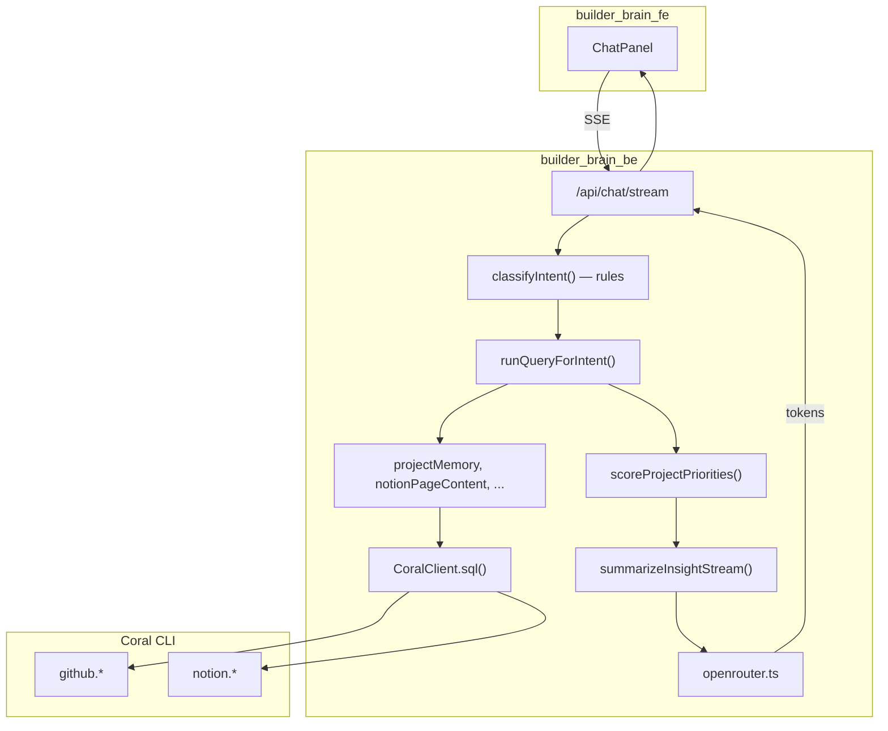

# BuilderBrain — LLM Layer Architecture (as implemented)

This document describes **how the system actually works today**: Coral for all data reads, TypeScript for routing and joins, OpenRouter for narration only.

---

## The core split

BuilderBrain is **not** a chatbot that guesses answers.

```text
User question
  → Rule-based intent (TypeScript, no LLM)
  → Fixed Coral query paths (TypeScript services, no LLM-generated SQL)
  → Coral CLI executes SQL against github.* / notion.*
  → App logic enriches rows (joins, filters, scoring)
  → OpenRouter summarizes the JSON (optional)
  → Chat UI (SSE stream)
```

| Layer | Technology | Role |
|--------|------------|------|
| **Source of truth** | [Coral](https://github.com/coralhq/coral) | GitHub + Notion reads via SQL |
| **Orchestration** | TypeScript (`builder_brain_be`) | Intents, templates, joins, scoring |
| **Narration** | [OpenRouter](https://openrouter.ai) | Markdown summary of structured rows |
| **UI** | Next.js (`builder_brain_fe`) | Streaming chat, stop button |

The LLM **never** chooses SQL, never calls GitHub/Notion directly, and never invent repos or pages.

---

## OpenRouter (narration provider)

### What we use

- **API**: OpenAI-compatible `POST https://openrouter.ai/api/v1/chat/completions`
- **Client**: `builder_brain_be/src/llm/openrouter.ts`
- **Summarizer**: `builder_brain_be/src/llm/summarize.ts`
- **Model**: set by `OPENROUTER_MODEL` in `builder_brain_be/.env`
  - Code default (if unset): `openai/gpt-4o-mini` (`src/config/env.ts`)
  - Example in `.env.example`: `openai/gpt-oss-120b:free` (swap to any [OpenRouter model](https://openrouter.ai/models))

### Request settings

| Parameter | Value | Notes |
|-----------|--------|--------|
| `temperature` | `0.3` | Low variance for factual summaries |
| `max_tokens` | `800` | Keeps answers concise |
| `stream` | `true` on `/api/chat/stream` | Tokens forwarded as SSE `token` events |

### Credentials

```env
# builder_brain_be/.env
OPENROUTER_API_KEY=sk-or-...
OPENROUTER_MODEL=openai/gpt-4o-mini   # or openai/gpt-oss-120b:free, etc.
```

- **GitHub / Notion tokens** live in Coral (`coral source add`), not in OpenRouter.
- Only `OPENROUTER_API_KEY` is sent to OpenRouter.
- If the key is missing, the pipeline still runs Coral and returns a **deterministic fallback** (`fallbackSummary` in `summarize.ts`).

### What OpenRouter receives

A single chat completion with two messages:

1. **System prompt** — rules in `summarize.ts` (only use JSON facts, no HTML in tables, GitHub-only intents must not ask for Notion pages, etc.).
2. **User message** — JSON payload:

```json
{
  "user_question": "Which repos are stale but still in my notes?",
  "intent": "Abandoned projects",
  "coral_sql": "-- Project memory (abandoned): ...",
  "row_count": 1,
  "rows": [ /* up to 25 rows */ ],
  "project_priorities": [ /* optional, from scoring.ts */ ]
}
```

OpenRouter returns natural-language Markdown. It does **not** receive raw Coral credentials or write access to providers.

### Streaming & cancellation

- **Batch**: `POST /api/chat` → `chatCompletion()` → full string.
- **Stream**: `POST /api/chat/stream` → `chatCompletionStream()` → SSE phases:
  - `status` (classifying → querying → summarizing)
  - `meta` (intent, sql, rows, `usedLlm`)
  - `token` (OpenRouter deltas)
  - `done` or `cancelled`
- **Stop button**: aborts the fetch; backend aborts OpenRouter stream via `AbortSignal` on client disconnect.

---

## Coral (data layer)

### Execution model

`CoralClient` (`builder_brain_be/src/coral/client.ts`):

```text
coral sql --format json "<SELECT ...>"
```

- Subprocess inherits shell env (Coral reads `GITHUB_TOKEN` / `NOTION_API_KEY` from Coral config).
- **Read-only guard**: only `SELECT` / `WITH`; no multi-statement SQL (`coral/validate.ts`).
- Auto-`LIMIT 100` if missing.
- 60s timeout per query.

### Query templates (not LLM-generated)

SQL lives in typed modules, selected by intent:

| File | Coral surfaces |
|------|----------------|
| `coral/integrations/github.queries.ts` | `github.user_repos`, `github.commits`, `github.issues`, `github.search_*` |
| `coral/integrations/notion.queries.ts` | `notion.search_objects`, `notion.pages`, `notion.block_children`, `notion.search` |
| `queries/templates.ts` | `coral.inputs` for source status |

Services compose multiple Coral calls:

| Service | Coral usage |
|---------|-------------|
| `projectMemory.ts` | `user_repos` + Notion index + per-repo `commits` |
| `githubNotionJoin.ts` | Uses rows from `search_objects` / `listVisible` |
| `notionPageContent.ts` | `pages` + `block_children` → `content_plain` |
| `repoIssues.ts` | `issues` for owner/repo |
| `listRecentGithubProjects` | `user_repos` + `commits`, activity window or latest N |

### Cross-source join (app layer)

Coral has no `JOIN github.repos TO notion.pages`. BuilderBrain:

1. Loads Notion pages via Coral search.
2. Loads GitHub repos via `user_repos`.
3. Matches repo slugs to page titles/properties in TypeScript (`githubNotionJoin.ts`).
4. Filters to **your** repos (`owner__type = User` or `permissions__admin`, optional `GITHUB_PROJECT_OWNERS`).

---

## Pipeline (end-to-end)



Implementation: `agent/pipelineStream.ts` (stream) and `agent/pipeline.ts` (batch).

### Phases

1. **Classifying** — `intents/classify.ts` (regex/rules, no LLM).
2. **Querying** — Coral subprocess + service enrichment (can take 30–90s for many repos).
3. **Summarizing** — OpenRouter stream (if key set) or `streamPlainText(fallback)`.
4. **Complete** — SSE `done` with full `ChatPipelineResult`.

---

## Intent routing (no LLM)

All routing is **rule-based** in `intents/classify.ts`. Examples:

| Intent | Trigger examples | Coral / service path |
|--------|------------------|----------------------|
| `abandoned_projects` | "abandoned", "stale", "inactive repo" | `buildProjectMemory` (abandoned mode) |
| `repo_activity` | "recent activity", "last 30 days", "github repos" | `listRecentGithubProjects` |
| `repo_issues` | "issues in wallet-orchestrator" | `github.issues` |
| `notion_page_content` | "contents inside Wallet Orchestrator Ideas" | `block_children` |
| `notion_search` | "notion pages about X" | `notion.search_objects` |
| `project_overview` | "github and notion", cross-link questions | `buildProjectMemory` (overview) |
| `sources_status` | "connected sources" | `coral.inputs` |
| `general` | keyword fallback | overview project memory |
| `mcp_action` | "schedule", "create event" | **Not wired** — static read-only message |

Priority order matters (e.g. GitHub activity is checked **before** Notion page-content so "show recent activity" is not misrouted).

---

## Deterministic intelligence (not LLM)

Before OpenRouter runs, TypeScript computes:

| Logic | File | Purpose |
|-------|------|---------|
| Staleness | `projectMemory.ts` | 28+ days since latest **commit** (not just `pushed_at`) |
| Repo scope | `githubRepoFilter.ts` | Exclude read-only org cohort repos |
| GitHub ↔ Notion links | `githubNotionJoin.ts` | Slug/title matching |
| Priority scores | `scoring.ts` | `projectPriorities` passed to LLM as hints |

```ts
// scoring.ts — deterministic, not LLM
score += recent code activity | stale_days
score += linked Notion pages
score += Notion edited this week
```

These scores are **inputs** to the summarizer; the model narrates them, it does not compute them.

---

## What the LLM does and does not do

### OpenRouter is used for

- Turning Coral JSON rows into readable Markdown (tables, bullets).
- Highlighting cross-source patterns (stale code + active Notion).
- Explaining repo ↔ page links when present in rows.

### OpenRouter is **not** used for

- Intent classification
- SQL generation or query planning
- GitHub/Notion API calls
- Join logic or staleness thresholds
- Writing to calendar, Todoist, Notion, or GitHub (`mcp_action` is read-only v1)

### Reliability rules (system prompt)

From `summarize.ts`:

- Only reason about facts in the JSON payload.
- Do not invent repos, pages, or activity.
- For `repo_activity`, do not ask for a Notion page.
- When `content_plain` is present, summarize it directly.
- If rows are empty, suggest `coral source add github` / `notion`.
- No HTML tags in output (use ` · ` in tables).

---

## Backend file map (LLM + Coral)

```text
builder_brain_be/src/
├── agent/
│   ├── pipeline.ts           # POST /api/chat
│   └── pipelineStream.ts     # POST /api/chat/stream (SSE)
├── intents/
│   ├── classify.ts           # Rule-based routing (no LLM)
│   ├── extractTerms.ts       # Query terms, activity windows
│   └── extractNotionPageTitle.ts
├── coral/
│   ├── client.ts             # coral sql subprocess
│   ├── validate.ts           # SELECT-only guard
│   └── integrations/
│       ├── github.queries.ts
│       ├── notion.queries.ts
│       ├── github.ts
│       └── notion.ts
├── queries/
│   ├── runner.ts             # intent → service dispatch
│   └── templates.ts          # sources_status SQL
├── services/
│   ├── projectMemory.ts      # Core read model
│   ├── githubNotionJoin.ts
│   ├── notionPageContent.ts
│   ├── repoIssues.ts
│   ├── githubRepoFilter.ts
│   └── scoring.ts
├── llm/
│   ├── openrouter.ts         # chatCompletion + chatCompletionStream
│   └── summarize.ts          # System prompt + payload builder
└── routes/
    └── chat.routes.ts        # SSE + abort on client disconnect
```

---

## API surface

| Endpoint | LLM? | Coral? |
|----------|------|--------|
| `POST /api/chat` | Optional summarize | Always |
| `POST /api/chat/stream` | Optional stream summarize | Always |
| `GET /api/sources/status` | No | `coral.inputs` |
| Integration routes | No | Direct Coral reads |

---

## Operating without OpenRouter

1. Set up Coral: `coral source add github`, `coral source add notion`.
2. Leave `OPENROUTER_API_KEY` empty.
3. Chat still returns:
   - Correct intent
   - Coral SQL comments + row count in `meta`
   - Fallback text: `"Found N row(s) for … Set OPENROUTER_API_KEY to enable natural-language summaries."`

Coral remains fully functional; only the narration layer is disabled.

---

## Design principles (unchanged, now enforced in code)

1. **Coral first** — All provider reads go through `coral sql`.
2. **No LLM SQL** — Intents map to fixed query patterns in TypeScript.
3. **Deterministic joins & scoring** — TypeScript, testable, demo-stable.
4. **LLM as narrator** — OpenRouter explains structured results; it is not the database.
5. **Read-only v1** — No write actions; `mcp_action` returns a clear stub message.

---

## Related docs

- [README.md](./README.md) — Setup, Makefile, Coral tables reference, example questions.
