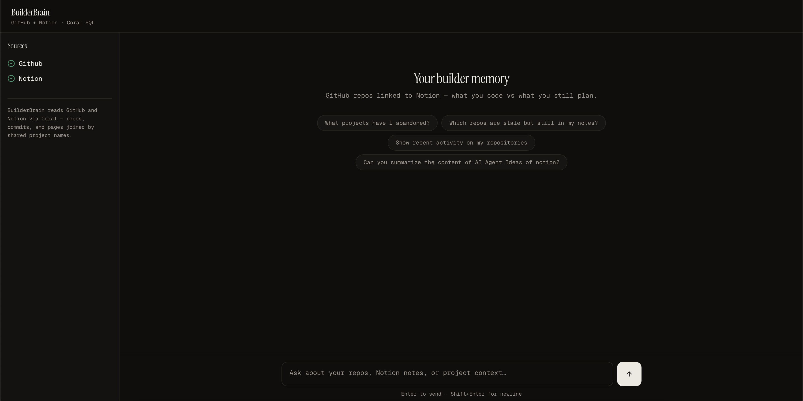
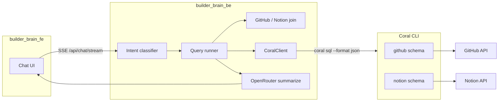

# BuilderBrain



As a dev we always have a lot of incomplete projects, untracked works, forgotten notes in the ocean of notion pages. So I thought for my personal use I'll build a personal **project memory** assistant that connects **GitHub** (what you code) with **Notion** (what you plan). BuilderBrain answers natural-language questions by querying live data through [Coral](https://github.com/withcoral/coral) SQL, then optionally narrates results with an LLM.

**Coral is the source of truth.** OpenRouter is used only to summarize structured query results — it never invents repos, pages, or activity.

---

## How it works



1. **You ask** in the chat UI (e.g. “Which repos are stale but still in my Notion ideas pages?”).
2. **Intent routing** (rule-based, no LLM) picks a read path: abandoned projects, recent activity, Notion page body, repo issues, cross-source join, etc.
3. **Coral SQL** runs against `github.*` and `notion.*` tables via the Coral CLI subprocess.
4. **Application logic** enriches rows (commit dates, repo↔page links, filters for _your_ repos vs read-only org repos).
5. **OpenRouter** (optional) turns the JSON rows into a short Markdown answer. If `OPENROUTER_API_KEY` is unset, you still get structured data with a minimal fallback message.

---

## Design principles

1. **Coral first** — All provider reads are SQL against Coral schemas; subprocess inherits your Coral config.
2. **No LLM SQL** — Intents select fixed query patterns; prevents injection and hallucinated tables.
3. **Real data only** — Summaries must cite rows returned from Coral; empty results suggest fixing sources/sharing.
4. **Your repos** — Org repos you can see but not push to (e.g. bootcamp orgs) are filtered out of project memory.

**NOTE**: **Read-only v1** — No creating issues, editing Notion, or calendar writes (`mcp_action` intent explains this).

---

## Coral’s role (core design)

BuilderBrain does **not** call GitHub or Notion REST APIs directly. Every external read goes through Coral’s SQL interface, which maps tables and table functions to provider APIs.

### Execution model

| Piece               | Location                                 | Behavior                                                                                        |
| ------------------- | ---------------------------------------- | ----------------------------------------------------------------------------------------------- |
| **CoralClient**     | `builder_brain_be/src/coral/client.ts`   | Spawns `coral sql --format json "<query>"` with your shell env (tokens from `coral source add`) |
| **Read-only guard** | `builder_brain_be/src/coral/validate.ts` | Only `SELECT` / `WITH`; no multi-statement SQL                                                  |
| **Query templates** | `github.queries.ts`, `notion.queries.ts` | Parameterized Coral SQL — the LLM never writes arbitrary SQL                                    |
| **Integrations**    | `GithubIntegration`, `NotionIntegration` | Thin wrappers: run SQL, map rows to typed objects                                               |

Credentials live in **Coral**, not in application code:

```bash
coral source add github   # GITHUB_TOKEN
coral source add notion   # NOTION_API_KEY — share pages with the integration
```

Connection health is checked with Coral’s metadata table:

```sql
SELECT key, is_set
FROM coral.inputs
WHERE schema_name IN ('github', 'notion')
```

### GitHub tables used

| Coral relation               | Purpose in BuilderBrain                                                                                            |
| ---------------------------- | ------------------------------------------------------------------------------------------------------------------ |
| `github.user_repos`          | List repos; `owner__type`, `permissions__admin`, `permissions__push` to exclude org cohort repos you can’t push to |
| `github.commits`             | Latest commit message & `commit__author__date` for staleness (not just `pushed_at`)                                |
| `github.issues`              | Open/closed issues for a given `owner` + `repo`                                                                    |
| `github.search_repositories` | Repo search helper                                                                                                 |
| `github.search_issues`       | Issue search helper                                                                                                |
| `coral.inputs`               | Whether `GITHUB_TOKEN` is configured                                                                               |

Example (recent commits for staleness):

```sql
SELECT sha, commit__message, commit__author__date, author__login
FROM github.commits
WHERE owner = 'Manice18' AND repo = 'wallet-orchestrator'
LIMIT 3
```

Empty repos return HTTP 409 from GitHub; the integration catches that and treats commits as `[]` instead of failing the whole chat.

### Notion tables & functions used

| Coral relation                                          | Purpose in BuilderBrain                                                         |
| ------------------------------------------------------- | ------------------------------------------------------------------------------- |
| `notion.search_objects(query => '…', object => 'page')` | Find pages by title/keywords (“ideas”, repo slug)                               |
| `notion.search`                                         | Fallback listing of visible pages                                               |
| `notion.pages`                                          | Page metadata by `page_id`                                                      |
| `notion.block_children`                                 | **Page body** — `block_id` = page UUID; `rich_text` parsed into `content_plain` |
| `notion.data_source_pages` / `notion.data_sources`      | Optional database-backed pages                                                  |
| `coral.inputs`                                          | Whether `NOTION_API_KEY` is set                                                 |

Example (full page content):

```sql
SELECT id, type, has_children, rich_text, created_time, last_edited_time
FROM notion.block_children
WHERE block_id = '36ec08b5-4fe2-80cd-bc2e-e1e118c95911'
LIMIT 500
```

`notionContent.ts` flattens `rich_text` blocks into plain text for the LLM.

### Cross-source join (app layer, Coral-fed data)

Coral has no single “join GitHub to Notion” table. BuilderBrain builds **project memory** in TypeScript:

1. Load pages: `notion.listVisible` + `notion.search_objects` per repo slug (and user terms like “ideas”).
2. Load repos: `github.user_repos` → filter to **your** repos (`owner__type = User` or `permissions__admin`, optional `GITHUB_PROJECT_OWNERS`).
3. **Match** repo slugs to page titles/properties (e.g. `wallet-orchestrator` ↔ “Wallet Orchestrator Ideas”).

See `githubNotionJoin.ts` and `projectMemory.ts`.

### Intents → Coral workloads

| Intent                | Coral-heavy operations                                                    |
| --------------------- | ------------------------------------------------------------------------- |
| `project_overview`    | `user_repos` + Notion index + optional commits per linked repo            |
| `abandoned_projects`  | Same, filter stale (28+ days by commit date) ∩ linked Notion pages        |
| `repo_activity`       | `user_repos` + `commits`; filter activity in last N days (push or commit) |
| `notion_search`       | Multiple `search_objects` calls from query terms                          |
| `notion_page_content` | `search_objects` / `pages` + `block_children`                             |
| `repo_issues`         | `user_repos` (resolve owner) + `issues`                                   |
| `sources_status`      | `coral.inputs` for github + notion                                        |

---

## Example questions

| Question                                                         | What Coral + app logic do                        |
| ---------------------------------------------------------------- | ------------------------------------------------ |
| What are my abandoned projects (synced between GitHub & Notion)? | Stale personal repos with linked Notion pages    |
| Which GitHub repo matches my Notion ideas pages?                 | Cross-link index + “ideas” filter on page titles |
| What are the contents inside Wallet Orchestrator Ideas?          | `block_children` → summarize body                |
| What GitHub projects have I used in the last 30 days?            | `user_repos` + `commits`, 30-day window          |

---

## Repository layout

```
builder_brain/
├── builder_brain_be/          # Express API, Coral client, intents, pipeline
│   ├── src/
│   │   ├── agent/             # Chat pipeline (stream + batch)
│   │   ├── coral/             # CoralClient, SQL validation, integrations
│   │   ├── intents/           # Rule-based routing
│   │   ├── services/          # projectMemory, notionPageContent, joins
│   │   ├── queries/           # Intent → service dispatch
│   │   └── routes/            # /api/chat, /api/chat/stream, integrations
│   └── .env.example
├── builder_brain_fe/          # Next.js chat UI (SSE streaming, stop button)
│   └── .env.local.example
├── Makefile                   # install, start-dev / stop-dev, start-prod / stop-prod
└── README.md
```

---

## Prerequisites

- **Node.js** 20+
- **Coral CLI** installed and on `PATH` (`CORAL_BIN=coral`)
- **GitHub** personal access token (via `coral source add github`)
- **Notion** integration token; pages shared with the integration (`coral source add notion`)
- **OpenRouter** API key (optional, for natural-language summaries)

---

## Setup

### 1. Install dependencies

From the repo root:

```bash
make install
```

This runs `npm install` in `builder_brain_be` and `builder_brain_fe`. Run again after pulling dependency changes.

### 2. Environment files

```bash
cp builder_brain_be/.env.example builder_brain_be/.env
cp builder_brain_fe/.env.local.example builder_brain_fe/.env.local
```

Edit `builder_brain_be/.env`: `OPENROUTER_API_KEY`, `FE_ORIGIN`, optional `GITHUB_PROJECT_OWNERS=YourUsername`.

Edit `builder_brain_fe/.env.local`: `NEXT_PUBLIC_API_URL=http://localhost:8080`.

### 3. Coral sources

```bash
coral source add github
coral source add notion
```

Share the Notion pages you care about with your integration.

---

## Running the app

From the repo root:

```bash
make install      # first time (or after package.json changes)
make start-dev    # BE :8080 (tsx watch) + FE :3000 (next dev)
make stop-dev

make start-prod   # npm run build in both, then production servers
make stop-prod

make status       # PID / running state
make help         # list all targets
```

Logs: `.logs/be-dev.log`, `.logs/fe-dev.log` (and `*-prod` for production).

Manual dev (two terminals):

```bash
cd builder_brain_be && npm run dev
cd builder_brain_fe && npm run dev
```

Open **http://localhost:3000**. API: **http://localhost:8080**.

---

## API (high level)

| Method | Path                                             | Description                                                |
| ------ | ------------------------------------------------ | ---------------------------------------------------------- |
| `POST` | `/api/chat`                                      | Full JSON response (batch)                                 |
| `POST` | `/api/chat/stream`                               | SSE: `status` → `meta` → `token` → `done` (or `cancelled`) |
| `GET`  | `/api/sources/status`                            | Coral `coral.inputs` for github + notion                   |
| `GET`  | `/api/integrations/github/repos`                 | Raw repo list via Coral                                    |
| `GET`  | `/api/integrations/notion/pages/:pageId/content` | Page body via `block_children`                             |

Streaming phases: `classifying` → `querying` (Coral) → `summarizing` (OpenRouter).

---

## Configuration

| Variable                | Where           | Purpose                                            |
| ----------------------- | --------------- | -------------------------------------------------- |
| `CORAL_BIN`             | BE `.env`       | Path to `coral` executable                         |
| `GITHUB_TOKEN`          | Coral (not BE)  | Via `coral source add github`                      |
| `NOTION_API_KEY`        | Coral           | Via `coral source add notion`                      |
| `OPENROUTER_API_KEY`    | BE `.env`       | Summaries only                                     |
| `GITHUB_PROJECT_OWNERS` | BE `.env`       | Optional: comma-separated owners (e.g. `Manice18`) |
| `FE_ORIGIN`             | BE `.env`       | CORS for Next.js origin                            |
| `NEXT_PUBLIC_API_URL`   | FE `.env.local` | Backend URL                                        |

---

## Future Improvements

BuilderBrain is currently a read-only project memory assistant. Future versions could include:

- **Persistent Memory Layer** — Track recurring interests, project history, abandoned projects, and long-term patterns across tools.
- **GitHub Write Actions** — Create issues, project tasks, and follow-up actions directly from chat.
- **Notion Write Actions** — Create pages, save insights, append notes, and generate project retrospectives.
- **Calendar & Task Integrations** — Add Google Calendar and Todoist to combine code activity with deadlines and personal planning.
- **Focus Recommendation Engine** — Rank projects based on activity, tasks, notes, and upcoming deadlines.
- **Unified Project Timeline** — Merge GitHub, Notion, tasks, and calendar events into a single chronological view.
- **More Coral Sources** — Expand to Linear, Slack, Google Drive, and other Coral-supported integrations.
- **MCP Actions** — Enable actionable workflows such as scheduling focus sessions, creating tasks, and saving project context.

---

## Troubleshooting

| Symptom                                 | Likely fix                                                                                       |
| --------------------------------------- | ------------------------------------------------------------------------------------------------ |
| “Connect GitHub/Notion” with empty rows | `coral source add …`, share Notion pages, check `make status` / sources sidebar                  |
| Coral 409 empty repository              | Normal for empty repos; other repos still work                                                   |
| Page title but no body                  | Ensure `notion.block_children` is available; ask with page name for `notion_page_content` intent |
| Org repos in abandoned list             | Set `GITHUB_PROJECT_OWNERS` or rely on default User/admin filter                                 |

---

## License

Private / hackathon project — adjust as needed for your fork.
